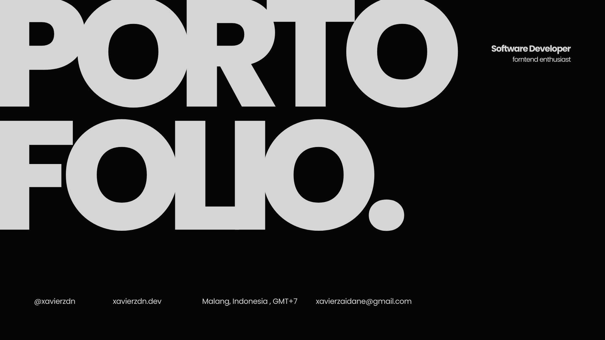

# Xavier — Software Developer (Frontend Enthusiast)

I design and build fast, AI‑driven products for the web.

I’m Xavier, a Computer Science undergraduate and frontend-focused full stack developer based in Malang, Indonesia. i work in building responsive interfaces powered by modern frameworks and AI systems — turning complex ideas into intuitive, high-performance products.

Over the last 1+ years, I’ve shipped dashboards, editors, booking tools, and 3D experiences used by real users, teams, and businesses. This portfolio is a collection of those experiments and products.

## What I do

AI that works in the UI: I build AI features that live directly in the UI — from RAG-based chatbots to LLM-powered recommendation systems. My work includes designing multi-stage pipelines, optimizing latency (up to 40% faster), and delivering responsive AI experiences that feel seamless to users.

Modern frontend, production-ready: I ship with Next.js, React, Vue, and TypeScript, integrating real data (Supabase, APIs, WebSockets) and real infra (Vercel, Cloudflare, Docker) — not just static prototypes.

Design that feels intentional: I care about micro‑interactions, layout, contrast, and motion. The goal is always the same: interfaces that feel obvious to use, even when the product behind them is complex.

## Stats

  

## Get in Touch 📬

I'm always open to new opportunities and collaborations. Feel free to reach out to me:

* **Email:** [Email me]([mailto:xavier@email.com)])

Thank you for visiting ! 😊
